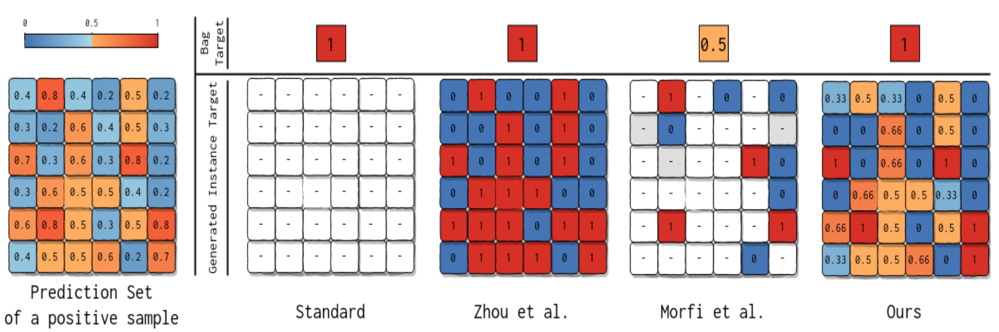

# Self-guiding Loss for Multiple Instance Learning


The Self-Guiding Loss is a novel multiple-instance learning loss which integrates artificial supervision based on the networks predictions into its formulation in an online step. The SGL can be seen as an extension to the standard MIL-setting. This repository contains the loss comparison studies on the MNIST-Bags dataset of the ACCV 2020 paper [**Self-Guided Multiple Instance Learning for Weakly Supervised Thoracic Disease Classification and Localization in Chest Radiographs**](https://arxiv.org).

> [**Self-Guided Multiple Instance Learning for Weakly Supervised Thoracic Disease Classification and Localization in Chest Radiographs**](https://arxiv.org)<br>
> Constantin Seibold, Jens Kleesiek, Heinz-Peter Schlemmer, Rainer Stiefelhagen<br>
> 
>
> **Abstract:** *Due to the high complexity of medical images and the scarcity of  trained  personnel,  most  large-scale  radiological  datasets  are  lacking fine-grained  annotations  and  are  often  only  described  on  image-level. These shortcomings hinder the deployment of automated diagnosis systems, which require human-interpretable justification for their decision process.  In  this  paper,  we  address  the  problem  of  weakly  supervised identification  and  localization  of  abnormalities  in  chest  radiographs  in a multiple-instance learning setting. To that end, we introduce a novel loss function for training convolutional neural networks increasing the localization confidence and assisting the overall disease identification. The loss leverages both image- and patch-level predictions to generate auxiliary supervision and enables specific training at patch-level. Rather than forming strictly binary from the predictions as done in previous loss formulations, we create targets in a more customized manner. This way, the loss accounts for possible misclassification of less certain instances. We show that the supervision provided within the proposed learning scheme leads to better performance and more precise predictions on prevalent datasets  for  multiple-instance  learning  as  well  as  on  the  NIH  ChestX-Ray14 benchmark for disease recognition than previously used losses.*


## Contents

Available material to our paper can be found here:

| Path | Description
| :--- | :----------
| [SGL](https://github.com/ConstantinSeibold/SGL) | Main folder.
| &boxvr;[MNIST-Bags_Experiments](./MNIST-Bags_Experiments) | Contains the proposed loss formulation and MNIST-Bags experiments in Pytorch


## Citation
If you use this work or dataset, please cite:
```latex
@inproceedings{sgl,
  title={Self-Guided Multiple Instance Learning for Weakly Supervised Thoracic Disease Classification and Localization in Chest Radiographs},
  author={Seibold, Constantin and Kleesiek, Jens and Schlemmer, Heinz-Peter and Stiefelhagen, Rainer},
  booktitle={Asian Conference on Computer Vision},
  year={2020},
  organization={Springer}
}
